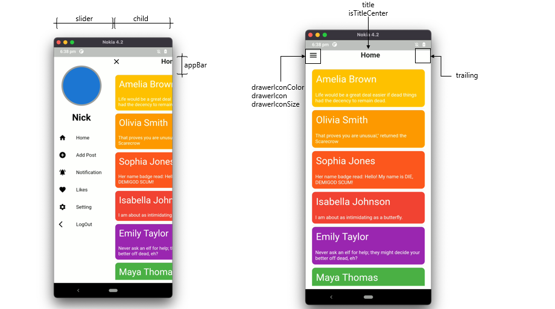
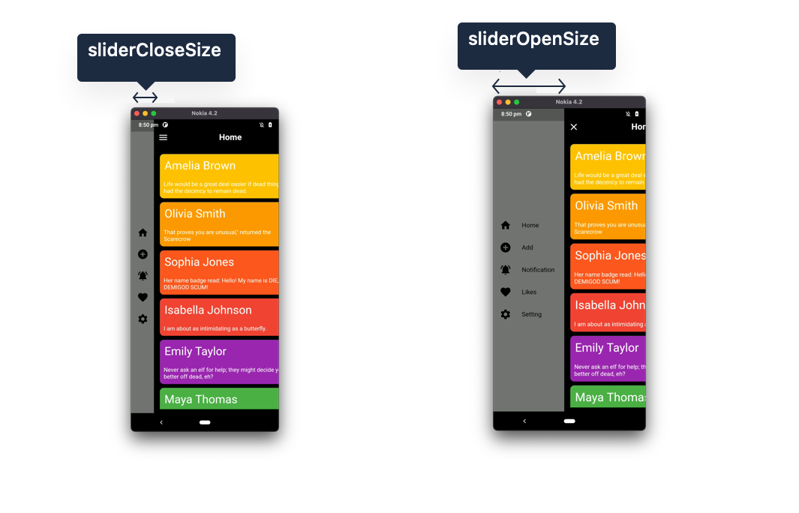
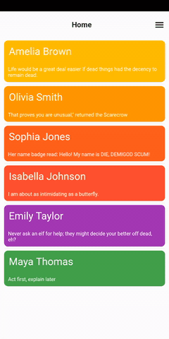
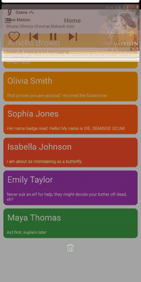

# Flutter slider drawer

[](https://pub.dev/packages/flutter_slider_drawer_enhanced)   [](https://pub.dev/packages/flutter_slider_drawer_enhanced)


A Flutter package with custom implementation of the Slider Drawer Menu with enhanced drawer height


&nbsp;&nbsp;&nbsp;&nbsp;&nbsp;


To start using this package, add `flutter_slider_drawer_enhanced` dependency to your `pubspec.yaml`

```yaml
dependencies:
  flutter_slider_drawer_enhanced: '<latest_release>'
```

 

# Features

  - Slider with custom animation time
  - Provide Basic Appbar with customization of color, size and title
  - Dynamic slider open and close offset
  - Provide drawer icon animation 
  - Provide shadow of Main screen with customization of shadow colors,blurRadius and spreadRadius
  - Provide RTL(RightToLeft),LTR(LeftToRight) and TTB(TopToBottom) slider open selection
  - Provide Custom Appbar support and you can also use plugin appBar with use of `SliderAppBar` widget
  - If you are using CupertinoApp then pass `isCupertino: true`


# Code 

```
  Widget build(BuildContext context) {
     return Scaffold(
         body: SliderDrawer(
           key: _key,
           appBar: SliderAppBar(
               appBarColor: Colors.white,
               title: Text(title,
                   style: const TextStyle(
                       fontSize: 22, fontWeight: FontWeight.w700))),
           slider: Container(color: Colors.red),
           child: Container(color: Colors.amber),
         ));
   }
 ```

</br>
 </br>

 
 </br>
 </br>
 </br>
 </br>
 
 

 </br>
 </br>


 # Slider open  

 | SliderOpen.LEFT_TO_RIGHT  | SliderOpen.RIGHT_TO_LEFT  | SliderOpen.TOP_TO_BOTTOM  |
 |---|---|---|
 |   |   |   |
 
 
 
 </br>

### Controlling the drawer

```
class _MyAppState extends State<MyApp> {
  GlobalKey<SliderDrawerState> _key = GlobalKey<SliderDrawerState>();

  @override
  Widget build(BuildContext context) {
    return Scaffold(
        body: SliderDrawer(
      key: _key,
      appBar: SliderAppBar(
          appBarColor: Colors.white,
          title: Text('Title',
              style:
                  const TextStyle(fontSize: 22, fontWeight: FontWeight.w700))),
      slider: Container(color: Colors.red),
      child: Container(color: Colors.amber),
    ));
  }
}
      
```

* Using the below methods to control drawer .
``` 
 _key.currentState.closeDrawer();
 _key.currentState.openDrawer();
 _key.currentState.toggle();
 _key.currentState.isDrawerOpen();

 ```
* Use below variable if you want to control animation.


``` _key.currentState.animationController```

License
----

BSD 2-Clause License
